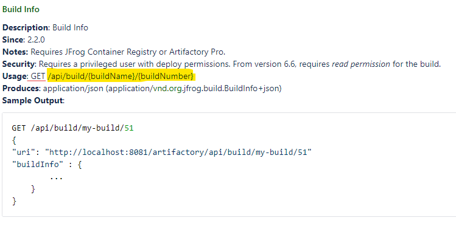
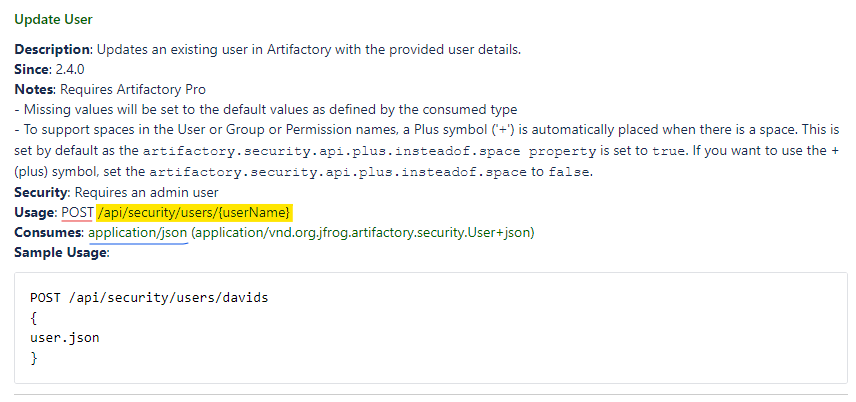

# jfr
*PowerShell wrapper for JFrog Artifactory API*

## Usage

#### Add Login
If running for the first time, User must provide default Artifactory login info:

    .\jfr.ps1 -add_login <string> -artifactory_base_url <string>

Value of ***-add_login*** parameter becomes a refernece name for this particular login configuration.

Value of ***-artifactory_base_url*** is an Artifactory instance URL (for example, `https://repo.domain.com` or `https://repo.domain.com/artifatory`).

User will be prompted to provide username/password, which will be used to request existing or generate a new API key. 

Once login info is provided and API key is received, it will be used automatically every time User runs API calls against Artifactory (login configurations are stored in *~/.jfr/config.json*).

Additional login configurations may be added, if more than one Artifactory instance is used, or if it is necessary to use separate credentials for different operations.

#### List Logins
To see all stored login configurations, run the following command:

    .\jfr.ps1 -list_logins

#### Set Default Login
If User does not explicitly specifies login configuration to be used with API call using ***-use_login*** parameter, then default login is used automatically. Default login config is the very first one added by User.

To set another login configuration as default, run the following command:

    .\jfr.ps1 -set_default_login <string>

where value of ***-set_default_login*** parameter is a reference name of the target login configuration.

#### Delete Login
To remove specific login from the logins cofingurations file, run the following command:

    .\jfr.ps1 -delete_login <string>

where value of ***-delete_login*** parameter is a reference name of the target login configuration.

If deleted login was set as default, the first config in login configurations file will become a new default.

#### Call API
To run an API call against Artifactory, use the following command (all parameters except for ***-call_api*** are optional):

    .\jfr.ps1 -call_api <string> [-api_method <string>] [-content_type <string>] [-request_data <string>] [-request_input_file <string>] [-output_file <string>] [-use_login <string>]

###### Parameters info:
| Parameter  | Alias | Default | Description |
| ------------- | ------------- | ------------- | ------------- |
| *call_api* | *api* | Mandatory parameter | API call-specific URL ending as shown in JFrog documentation (see below) |
| *api_method* | *m* | GET | Accepted values: DELETE, GET, PATCH, POST, PUT |
| *content_type* | *t* | application/json | Content type of the request body. Accepted values: "application/json", "application/x-www-form-urlencoded", "text/plain", "application/text" |
| *request_data* | *d* |  | Request body, data to be sent with the API call |
| *request_input_file* | *in* |  | File to be uploaded with the API call |
| *output_file* | *out* |  | Local file to store output of the API call |
| *use_login* | *login* | Mandatory value | Specifies login configuration to use instead of default login config. Value is target login reference name |

###### JFrog Documentation
[JFrog Artifactory REST API](https://www.jfrog.com/confluence/display/JFROG/Artifactory+REST+API)

###### Example of GET call:

    .\jfr.ps1 /api/build/my-build/51

###### Example of POST call:

    .\jfr.ps1 /api/security/users/davids -m POST -t application/json -in userdata.json

