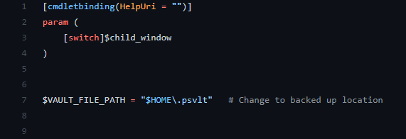

# Password Manager
*Local personal password vault*

### Dependencies
- UtilityFunctions (https://www.powershellgallery.com/packages/UtilityFunctions)

### Usage
Run `passwmngr.ps1` script:

    .\passwmngr.ps1

If running for the first time, the script will prompt to create new master password.

### Vault file

On the first run the script creates `.psvlt` file in user home directory. To change default location, edit value of $VAULT_FILE_PATH variable in the `passwmngr.ps1` script:

**Please note:** It makes sense to change the location of the vault to the directory that is being backed up regularly.
**Please note:** Only one vault is being used at a time. If you change location in the script, but do not move your vault file, the new vault will be created next time you run the script.

### Script discovery
To enable starting `passwmngr.ps1` script from anywhere, add the directory containing the scirpt to you PATH environment variable.
